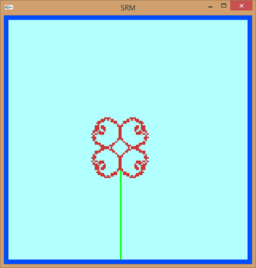

# OpenGL Texture Mapping Example

## Overview
This project demonstrates basic texture mapping using OpenGL. It creates a checkered texture with custom patterns and applies it to a 2D quad. The texture is generated dynamically and displayed on the screen.

## Features
- **Dynamic Texture Generation:** Creates a checkered image with custom patterns.
- **Texture Mapping:** Applies the generated texture to a 2D quad.
- **OpenGL Rendering:** Utilizes OpenGL for rendering the textured quad with basic transformations.

## Usage
- **Display Texture:** The program will automatically display the textured quad when run.
- **Exit:** Close the window.

## Results
Below is an example of the texture mapped onto a quad:

## Code Structure
- **main()**: Initializes OpenGL, sets up the display, and starts the main loop.
- **init()**: Configures OpenGL settings, generates the texture, and loads it into memory.
- **makeCheckImage()**: Generates a custom checkered texture pattern.
- **display()**: Renders the textured quad on the screen.
- **reshape()**: Adjusts the viewport and projection matrix when the window is resized.

## Dependencies
- **OpenGL**: 3D rendering library
- **GLUT**: Utility toolkit for OpenGL
- **GLAUX**: Additional utilities for OpenGL
